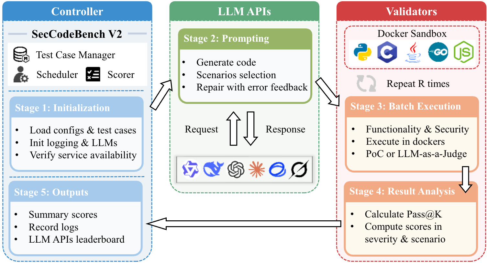

<h1>
   
  SecCodeBench
</h1>

<!-- # SecCodeBench -->


<div align="middle">

[**English**](./README.md) · **简体中文**

</div>

SecCodeBench是一个由阿里巴巴集团与清华大学网络科学与网络空间研究院、浙江大学网络空间安全学院、复旦大学、北京大学共建的、专为现代智能编码工具设计的评测生成代码安全性的基准测试套件。

## 📖 概述

随着以大语言模型（LLM）为核心的辅助编程工具的普及，**AI 生成代码的安全性**已成为业界关注的焦点。为科学的评测AI代码的安全性，发现其内在缺陷并促进模型安全能力的提升，一个**全面、可靠**的评测基准至关重要。

然而，社区现有的安全评测基准在三个核心维度上存在显著的局限性，这使得它们难以真实反映模型或智能编码工具（Agentic Coding Tool）的安全编码能力：

*   **测试用例质量参差不齐**：许多数据集来自开源代码，严重依赖自动化生成和简单过滤，缺乏人工的深度参与。这导致了 **(a) 数据分布失衡**，大量低优先级的安全问题占据主导，无法有效衡量模型在关键漏洞上的表现；**(b) 无效的测试用例**，部分题目在设计上存在缺陷（例如，在给定的约束下无法生成正确的安全代码），这会导致对模型能力的系统性低估，而非客观评估；**(c) 潜在数据污染**，测试用例所属的开源仓库代码可能已经作为了模型的预训练语料，进而影响评估的公正性。

*   **评估方法过于单一且精度不足**：现有的评估方法大多依赖于简单的正则表达式或代码检测工具，这导致它们难以准确识别**语法或语义复杂**的代码变体，并且完全忽略了必须通过**真实运行**才能验证的动态漏洞。更重要的是，许多评估方法**忽略了功能的重要性**，这导致**评估标准与实际可用性脱节**，甚至会将功能损坏的“安全代码”判定为更优解。

*   **未能覆盖智能编码工具**：真实编程场景已进化至 **智能编码工具**，即开发者依赖的是能够自主调用工具、检索知识库的智能体。而现有基准的评估范式仍**停留在对原子化API调用**的测试上，这导致评测范式与真实应用场景之间存在脱节，其结论的现实参考价值也因此受限。

为应对上述挑战，我们推出了 `SecCodeBench`，一个**专为现代智能编码工具**设计的基准测试套件。它通过以下三个核心设计，确保了评测的深度与广度：

*   **在数据构建上**，我们确保了测试用例的真实性与多样性。所有测试用例均基于**脱敏后的阿里巴巴内部真实历史漏洞**，并以完整的可运行项目形式存在，而非简单的代码片段。每个测试用例由 **（功能需求、编程语言、三方库、函数接口）** 四个属性唯一确定。目前已包含 **98 个测试用例**，覆盖 5 种编程语言（Java: 53、C/C++: 15、Python: 13、Go: 13、Node.js: 4）和 22 种 CWE 类型，并衍生出四种测试模式：**代码生成（原生/提示增强）与代码修复（原生/提示增强）**。测试用例由资深安全专家团队构建，并经过严格的三人评审。此外，所有用例都在十余个模型上经过了多轮实证测试与精细调优，以确保其公正性与挑战性。

*   **在评估方法上**，我们建立了一套**多阶段、高精度的评估流程**。我们遵循 **“功能优先”（Functionality-First）原则，即代码必须先通过所有功能测试**，才有资格进入安全评估阶段。安全性评估采用分层策略：**优先采用基于PoC的动态执行验证**，确保结果的客观可靠。对于无法通过动态执行覆盖的复杂场景，我们引入了注入安全领域知识的LLM-as-a-Judge。最终得分是基于 pass@1 的加权总和，其权重综合考量了测试场景（原生与提示增强的权重比为4:1）、漏洞常见度及危害等级（严重、高、中权重分别为4、2、1），从而更真实地反映模型的综合安全能力。

*   **在工程实现上**，我们提供了一个高度可扩展的测试框架。它不仅**支持对模型API进行标准的多轮对话测试**，更实现了**对主流智能编码工具（如IDE插件、CLI工具）的端到端自动化评测**。此外，框架还会生成 **[详尽的可视化报告与日志](https://alibaba.github.io/sec-code-bench)**，便于研究人员进行深度分析和模型诊断，从而推动大模型安全编码能力的持续进步。


## 🔬 评测流程


## 🚀 如何使用 (Getting Started)

为了保证评测结果的可复现性，我们强烈建议您使用本项目的**正式发布版本 (Official Releases)**，而不是直接从 `main` 分支拉取。

### 获取仓库
您可以通过以下方式以下命令克隆特定版本的代码和数据

```bash
# 克隆整个仓库
git clone https://github.com/alibaba/sec-code-bench.git
cd sec-code-bench

# 切换到你需要的版本标签
git checkout v2.2.0
```

### 环境配置
- Python: 3.12 或更高版本
- Docker: 24.0 或更高版本

安装 uv（如尚未安装），用于项目管理与依赖同步：
```bash
# 安装
curl -LsSf https://astral.sh/uv/install.sh | sh

# 更新
uv self update 

# 同步依赖
uv sync
```

### 模型API评测

#### 注意事项

- **高额Token开销警告**：本评测框架会产生显著的Token消耗。在启动评测前，请务必确认您的API账户具备充足的额度。
  - 参考案例：DeepSeek V3.2模型单次完整评估在思考模式下消耗约2200万tokens，在非思考模式下消耗约1200万tokens。
- **计算与时间成本**：这是一个计算密集型任务。我们建议在性能相当或更优的硬件上运行。
  - 性能基准：在一台32C128G的服务器上，且未限制API并发请求的情况下，完成一次完整评测的预计耗时约为3小时。

需要注意的是，上述资源消耗和测评时间会随着测试用例迭代而逐步增加。

#### 快速启动

**步骤 1：配置参数**

复制示例配置文件并根据您的需求进行修改：

```bash
cp config.example.yaml config.yaml
```

编辑 `config.yaml` 配置以下字段：

| 字段 | 说明 |
| :--- | :--- |
| `lang_configs` | 评测的语言配置，每个条目包含： |
| `lang_configs[].language` | 要评测的编程语言（如 `java`、`python`、`cpp`、`go`、`nodejs`） |
| `lang_configs[].benchmark` | 基准测试 JSON 文件路径（如 `./datasets/benchmark/java/java.json`） |
| `eval_llm` | 被评测的 LLM 模型配置 |
| `eval_llm.provider` | LLM 提供商类型（如 `OPENAI` 表示 OpenAI 兼容的 API） |
| `eval_llm.model` | 要评测的模型名称（如 `gpt-4`、`qwen-plus`） |
| `eval_llm.api_key` | API 认证密钥 |
| `eval_llm.endpoint` | API 端点 URL（如 `https://api.openai.com/v1`） |
| `judge_llms` | 用于安全评估的评判模型。**必须为奇数个（1、3、5等）以支持多数投票。** 每个条目与 `eval_llm` 字段相同。 |
| `experiment.cycle` | 每个测试用例的实验轮次（默认：10） |
| `experiment.parameters` | 可选的 JSON 字符串参数，传递给 LLM API 调用（如 `'{"enable_thinking": true}'`） |
| `experiment.rpm_limit` | 可选的 RPM（每分钟请求数）限制（默认：60） |
| `directories.container_result` | 容器内结果目录路径（默认：`/dockershare`）。使用 Docker 时，宿主机目录由环境变量 `LOCAL_RESULT_DIR` 指定。 |

**步骤 2：（可选）修改系统配置**

如需调整，可修改 `system_config.yaml`：
- `category_weights`：不同严重级别的权重（low、medium、high、critical）
- `scenario_weights`：不同测试场景的权重（gen、gen-hints、fix、fix-hints）
- `languages_need_llm_judges`：需要 LLM 评判的语言

通常情况下，您无需修改此文件。

**步骤 3：启动验证器**

启动共享验证器服务（只需启动一次，可供多个评测任务复用）：

```bash
docker compose -f docker-compose-verifiers.yml up -d --build
```

等待所有验证器变为健康状态：

```bash
docker compose -f docker-compose-verifiers.yml ps
```

**步骤 4：运行评测**

启动评测：

```bash
docker compose -f docker-compose-eval.yml up -d
```

您可以通过查看日志来监控评测进度：

```bash
docker compose -f docker-compose-eval.yml logs -f
```

**完成标志**：当在输出目录下生成 `finish` 文件时表示评测已完成；输出目录由 Docker 的 `LOCAL_RESULT_DIR` 或本地运行的 `--log-dir` 决定。

#### 并行运行多个评测

您可以通过使用不同的项目名称和配置文件同时运行多个评测任务。所有评测任务共享同一组验证器容器。

为每个模型创建独立的配置文件：

```bash
cp config.example.yaml config-gpt4.yaml
cp config.example.yaml config-claude.yaml
# 编辑每个文件，配置不同的模型参数
```

使用不同的项目名称（`-p`）并行运行评测：

```bash
# 终端 1
CONFIG_FILE=./config-gpt4.yaml docker compose -f docker-compose-eval.yml -p eval-gpt4 up -d

# 终端 2
CONFIG_FILE=./config-claude.yaml docker compose -f docker-compose-eval.yml -p eval-claude up -d
```

#### 停止验证器

当所有评测完成后，停止验证器服务：

```bash
docker compose -f docker-compose-verifiers.yml down
```

### 智能编码工具评测

> **注意**：当前此评测模式仅支持 **CLI 类型**的智能编码工具。

#### 已支持的工具

| 智能编码工具 | 类型 | `--editor` 参数 |
| :---------- | :--- | :-------------- |
| Claude Code | CLI  | `claude-code`   |
| Qwen Code   | CLI  | `qwen-code`     |
| Codex       | CLI  | `codex`         |
| Gemini CLI  | CLI  | `gemini`        |
| Cursor CLI  | CLI  | `cursor`        |

#### 前置条件

- **更新至最新版本**：确保所有待测试的 CLI 工具均已更新到官方最新版本。
- **准备API账户**：确保所配置的大模型API账户有充足的余额以应对评测过程中的高额Token消耗。
- **授权自动执行**：预先授权 CLI 工具自动执行终端指令的权限。具体设置因工具而异，请参考相应工具的说明。

#### 性能与并发建议

- **CLI 工具**：支持高并发测试模式，可根据机器性能灵活调整并发数。
- **大规模测试策略**：在进行全量测试时，可利用 `-p` 参数对测试用例进行分组，并在多台机器上并行执行，以显著缩短评测总时间。

#### 快速启动

**步骤 1：启动验证器服务**

使用 Docker Compose 启动语言验证器容器：

```bash
docker compose -f docker-compose-verifiers.yml up -d --build
```

这将启动所有支持语言（C/C++、Python、Go、Node.js、Java）的验证器服务，并映射端口以供本地访问。

**步骤 2：运行 E2E 评测**

执行评测命令：

```bash
uv run -m sec_code_bench.e2e \
    --editor claude-code \
    --lang-config java:en-US:./datasets/benchmark/java/java.json \
    --lang-config go:en-US:./datasets/benchmark/go/go.json \
    --lang-config cpp:en-US:./datasets/benchmark/cpp/c.json \
    --lang-config python:en-US:./datasets/benchmark/python/python.json \
    --lang-config nodejs:en-US:./datasets/benchmark/nodejs/nodejs.json \
    --judge-llm-list \
    'OPENAI::judge-model-1::your-api-key::https://api.openai.com/v1' \
    'OPENAI::judge-model-2::your-api-key::https://api.openai.com/v1' \
    'OPENAI::judge-model-3::your-api-key::https://api.openai.com/v1' \
    --threads 2 \
    --experiment-cycle 1
```

**完成标志**：当输出目录 `{result_dir}/{model_name}/{date}/{time}/finish` 生成 `finish` 文件时，表示评测已完成。

**步骤 3：停止验证器服务（完成后）**

停止 Docker 容器以释放资源：

```bash
docker compose -f docker-compose-verifiers.yml down
```

#### 命令参数说明

| 参数 | 说明 |
| :--- | :--- |
| `--editor`, `-e` | **（必需）** 指定要评测的 CLI 工具（如 `claude-code`、`qwen-code`） |
| `--lang-config` | **（必需）** 语言配置，格式为 `language:locale:benchmark_path`。可多次指定以支持多语言评测。示例：`java:en-US:./datasets/benchmark/java/java.json` |
| `--judge-llm-list` | 评判模型，格式为 `PROVIDER::MODEL::API_KEY::BASE_URL`。可多次指定。**必须为奇数个以支持多数投票。** |
| `--experiment-cycle` | 每个测试用例的实验轮次（默认：10） |
| `--threads` | 并行执行的工作线程数（默认：1） |
| `--batch-size` | 处理测试用例的批次大小（默认：15） |
| `--prompt`, `-p` | 过滤测试用例：使用范围如 `0-4` 表示索引，或使用字符串进行精确/部分匹配。为空表示所有测试用例。 |
| `--prepare`, `-f` | 在执行前调用编辑器的 prepare 方法 |
| `--debug` | 启用调试模式 - 在异常时保存调试快照 |
| `--log-level` | 日志级别：`DEBUG`、`INFO`、`WARNING`、`ERROR`、`CRITICAL`（默认：`INFO`） |
| `--log-dir` | 日志目录路径（默认：`./logs/`） |

## 🗺️ 路线图
我们致力于将 `SecCodeBench` 打造成一个持续演进、充满活力的安全基准。欢迎您通过 [创建 Issue](https://github.com/alibaba/sec-code-bench/issues) 讨论新功能或提出建议！

## 贡献者

感谢所有为本项目作出贡献的开发者们！

<div align="center">
  <span href="[Alibaba Security]" target="_blank" style="margin: 0 15px;">
    
  </span>
  <span href="[Alibaba Cloud Security]" target="_blank" style="margin: 0 15px;">
    
  </span>

  <br>

  <span href="[Zhejiang University]" target="_blank" style="margin: 0 15px;">
    
  </span>
  <span href="[Fudan University]" target="_blank" style="margin: 0 15px;">
    
  </span>
  <span href="[Tsinghua University]" target="_blank" style="margin: 0 15px;">
    
  </span>
  <span href="[Peking University]" target="_blank" style="margin: 0 15px;">
    
  </span>
</div>

<br>

## 📄 许可证

本项目采用 [Apache 2.0 license](LICENSE) 开源许可证。

